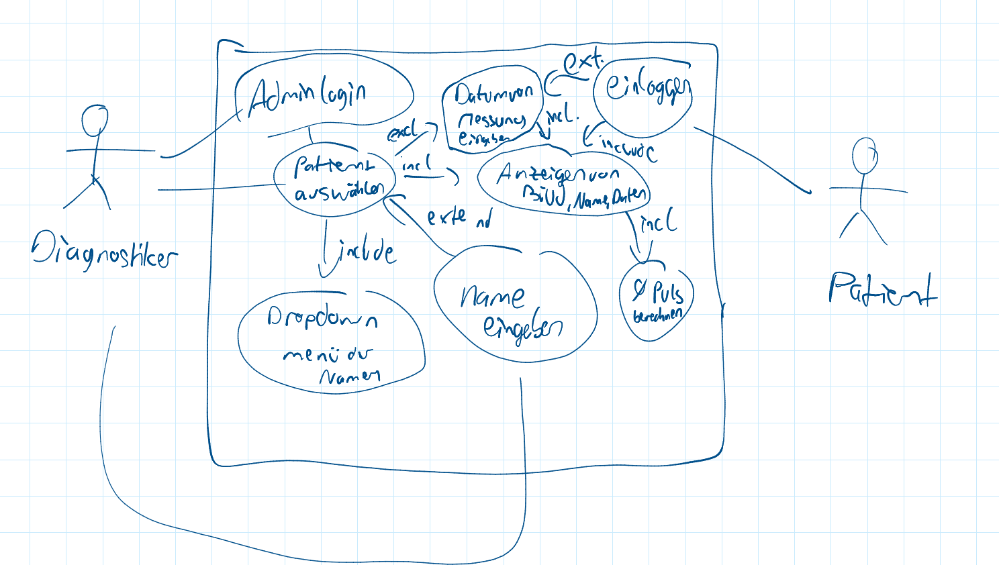
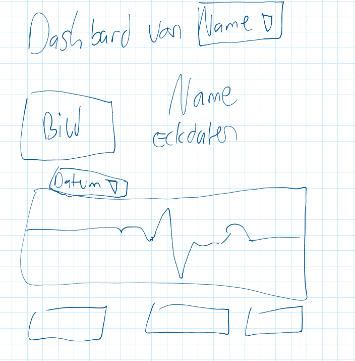
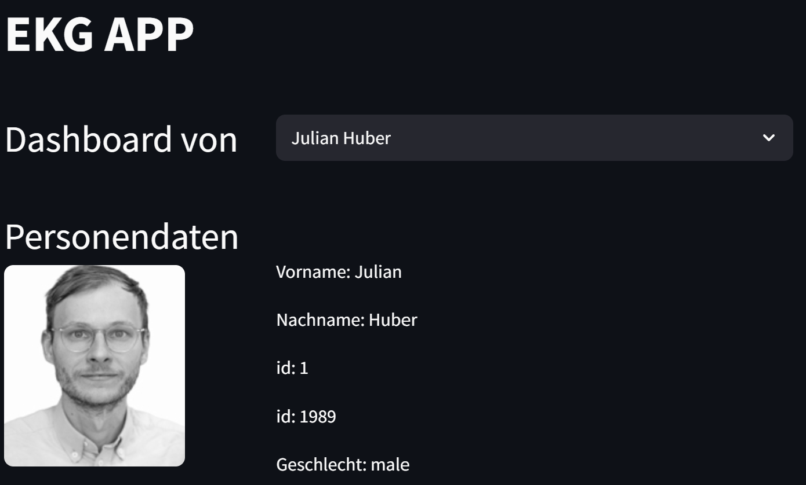
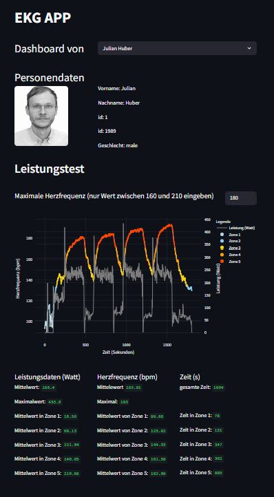
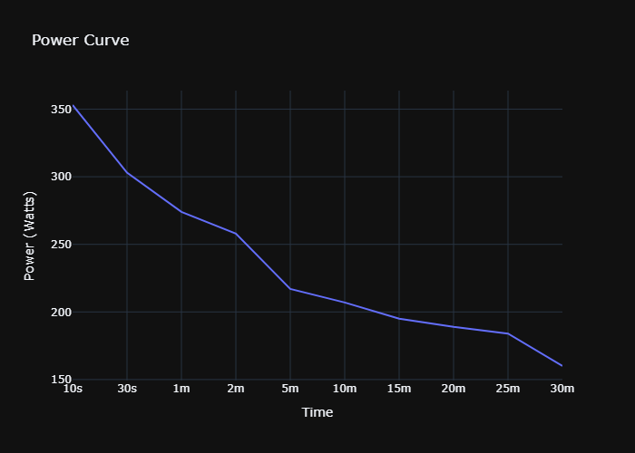
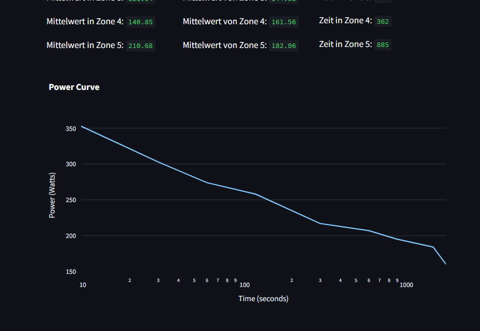

# Programier-bung2_Aufgabe2-5
Jakob Ladurner, Janick Hoffmann
## Aufgabe 2
### Vorarbeit
Zu Beginn sollte ein Use-Case-Diagramm, ein Activity Diagramm, sowie ein Mock up vom Dashboard erstellt werden.
Hier grob als Handskizzen:
- Use Case Diagramm:

- Activity Diagramm:

- Mock Up:

### Umsetzung
Nach erstellen einer read_data.py, in der die Daten geladen werden und es auch eine Funktion erstellt wurde, die ein Suchen der Daten einer Person ermöglicht, ging es daran das Mockup nachzubauen.

Schwierig war es dabei vor allem es so einzurichten, dass der Name der Person, dessen Dashboard angezeigt wird auch gleichzeitig das Auswahlfenster der Personen ist (wie es das Mockup vorgab)

### Ergebnis
Nach Aufgabe 2 hat das Programm folgendes aussehen:

## Aufgabe 3
### Beschreibung
Die App kann interaktiv nach Namensauswahl Personendaten und Bild einer im Datensatz gespeicherten Person ausgeben und präsentieren (Aufgabe 2).

Weiter wird unten ein Plot eines Leistungstests mit Herzfrequenz und Lesitungskurve angezeigt. Die Herzfrequenz wird in unterscheidliche Herzzonen, die farblich voneinander unterscheidne werden können, eingeteilt. Die Herzfreqeunzzonen-einteilung ist dynamisch, d.h. der Nutzer kann die Maximale Herzfreqeunz eingeben und die Zonen werden darauf angepasst.

Unter dem Plot finden sich noch weitere Werte zur besseren Diagnose der Kurven, wie Durchschnittsleistung und Zeit verbracht pro Herzfrequenzzone.

### Benutzung
Die App wird gestartet, indem man im Terminal "streamlit run main.py" eingibt. Dann kann man bei "Dashboard von" die zu betrachtende Person aus einem dropdown Menü auswählen. Über den Daten des Leistungstests kann man die maximale Herzfrequenz eingeben - der Wert ist zuerst standardmäßig auf 180bpm gesetzt.

In dem Plot kann man belibig über die Datenpunkte hovern um genaue Werte zu erhalten, oben rechts vom Plot gibt es noch weitere Funktionen, wie speichern als png und Zoomen.

### Ergebnis
Nach Aufgabe 3 schaut das Programm wiefolgt aus:

## Aufgabe 4
### Ablaufdiagramm

### Funktion
Es wird eine Leistungskurve erstellt mit der man erkennen kann wie lange man eine gewisse Leistung erbringen kann. Dafür werden die Leistungsdaten aus dme Dataframe gefiltert und anschließend mit Windows mit unterschiedlichen Zeitspannen über die daten rotiert. Von jedem window wird der Durchschnittswert gneommen und anschließend von allen durchschnittswerten der Maximalwert genommen.

Die Kurve der maximalleistungen wird mit plotly dargestellt. Außerdem wird die Kurve als power_curve.png gespeichert und in der Stramlit App unter der Grafik aus Aufgabe 3 dargestellt. 

### Ergebnis
Das gespeicherte Bild schaut wie folgt aus:

Die Streamlit App sieht nach nach der Aufgabe 4 wie folgt aus:

